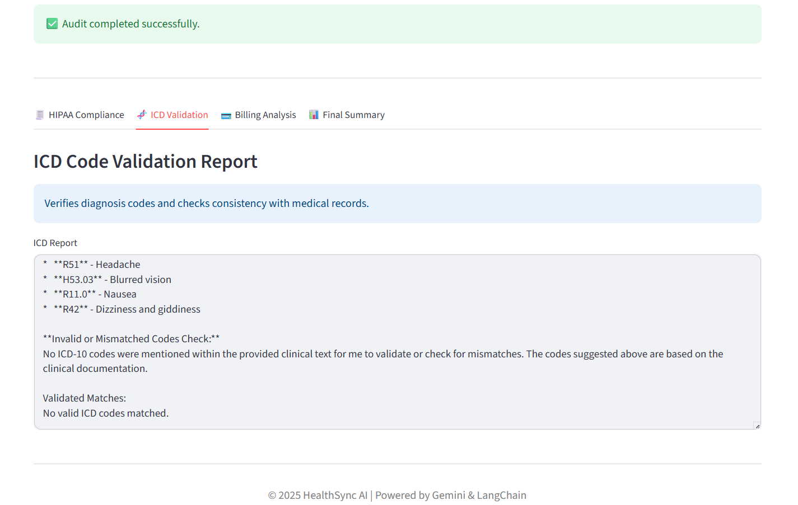
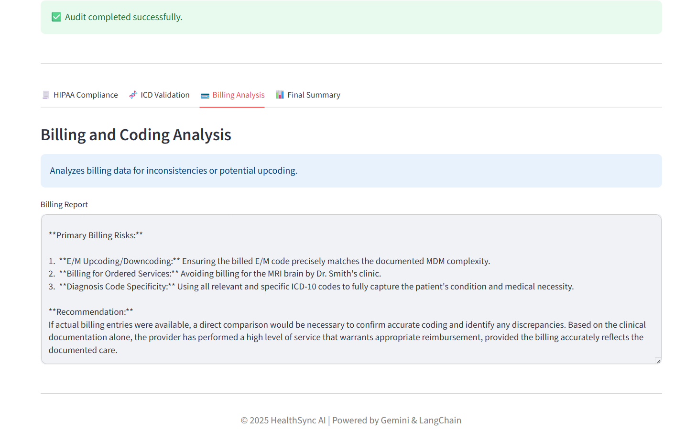
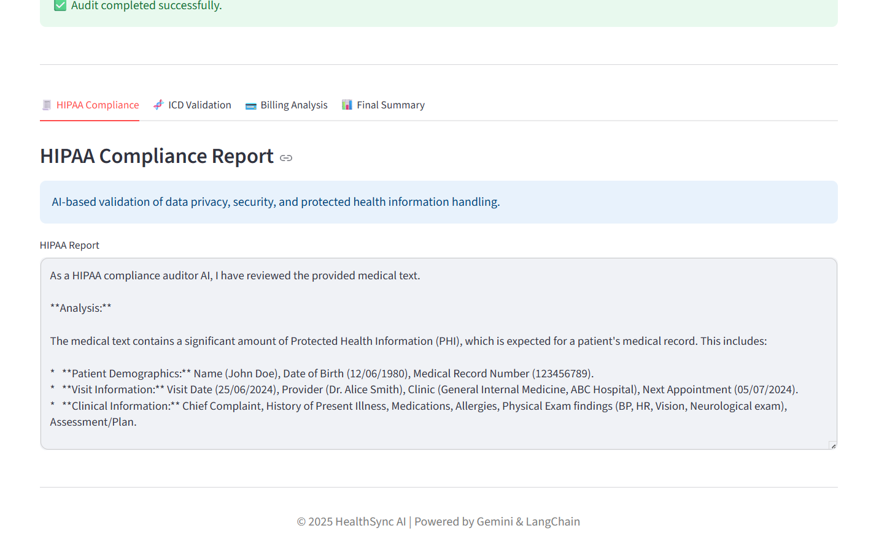
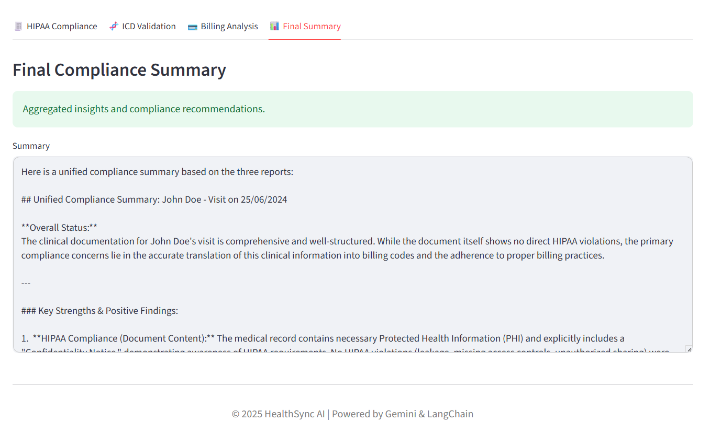

# HealthSync-Agentic-AI-Compliance-System
HealthSync is an agentic AI system designed to autonomously process healthcare-related documents using multiple specialized AI agents. The system orchestrates task-driven agents to perform ICD code extraction, billing validation, HIPAA compliance checks, and intelligent document summarization using large language models and agents.

---

## Agent Architecture
The system follows a modular multi-agent architecture:

- **Billing Agent** – Validates billing-related data and detects inconsistencies
- **ICD Coding Agent** – Extracts and verifies ICD codes from medical documents
- **HIPAA Compliance Agent** – Identifies potential compliance violations involving sensitive health data
- **Summary Agent** – Produces concise, context-aware document summaries
- **Orchestrator** – Manages agent coordination and task flow (`main.py`)

---

## System Workflow
1. User provides a healthcare-related document as input
2. The Orchestrator routes tasks to relevant agents
3. Each agent processes the document independently
4. Results are aggregated and presented as structured output

---

## Sample Outputs

### ICD Code Extraction

### Billing Validation

### HIPAA Compliance Check

### Intelligent Summary

---

## Tech Stack
- Python
- Large Language Models (Gemini / OpenAI)
- Custom Agent Orchestration
- Modular Tool-Based Architecture

---

## Project Structure

